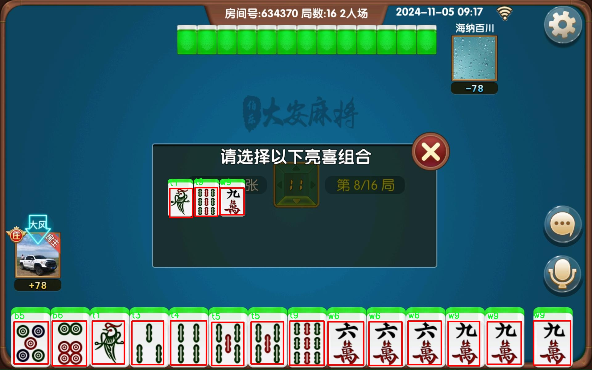

### 1.背景意义

研究背景与意义

随着人工智能技术的迅猛发展，计算机视觉在各个领域的应用日益广泛，尤其是在物体识别和定位方面。麻将作为一种深受欢迎的传统棋牌游戏，其复杂的牌面结构和多样的牌型使得麻将识别成为计算机视觉领域的一项挑战。传统的麻将识别方法往往依赖于手工特征提取和规则设定，难以适应不同的环境和牌局变化。因此，基于深度学习的自动化麻将识别与定位系统的研究显得尤为重要。

本研究旨在基于改进的YOLOv11模型，构建一个高效的麻将识别与定位系统。YOLO（You Only Look Once）系列模型以其快速的检测速度和较高的准确率在实时物体检测中表现出色。通过对YOLOv11进行改进，我们期望能够提升其在麻将牌识别中的性能，尤其是在复杂背景和不同光照条件下的适应能力。

本项目使用的数据集包含36个类别的麻将牌，包括各种花色和特殊牌型，共计414张经过标注的图像。这些图像经过了多种预处理和数据增强技术，确保了模型训练的多样性和鲁棒性。通过引入数据增强方法，如随机高斯模糊，进一步提升了模型的泛化能力，使其能够更好地适应现实场景中的变化。

本研究不仅具有重要的学术价值，也为麻将游戏的智能化发展提供了技术支持。通过实现高效的麻将识别与定位系统，可以为在线麻将游戏、智能麻将桌等应用提供基础，推动传统文化与现代科技的融合，具有广泛的社会和经济意义。

### 2.视频效果

[2.1 视频效果](https://www.bilibili.com/video/BV18DmxYDEh2/)

### 3.图片效果


##### [项目涉及的源码数据来源链接](https://kdocs.cn/l/cszuIiCKVNis)**

注意：本项目提供训练的数据集和训练教程,由于版本持续更新,暂不提供权重文件（best.pt）,请按照6.训练教程进行训练后实现上图演示的效果。

### 4.数据集信息

##### 4.1 本项目数据集类别数＆类别名

train: ../train/images
val: ../valid/images
test: ../test/images

nc: 36
names: ['b1', 'b2', 'b3', 'b4', 'b5', 'b6', 'b7', 'b8', 'b9', 'baopai', 'baoting', 'chi', 'gang', 'guo', 'peng', 't1', 't2', 't3', 't4', 't5', 't6', 't7', 't8', 't9', 'w1', 'w2', 'w3', 'w4', 'w5', 'w6', 'w7', 'w8', 'w9', 'x2', 'x3', 'z']

roboflow:
  workspace: 1-v3q3t
  project: 4-m6w2y
  version: 7
  license: Public Domain
  url: https://universe.roboflow.com/1-v3q3t/4-m6w2y/dataset/7


该项目为【目标检测】数据集，请在【训练教程和Web端加载模型教程（第三步）】这一步的时候按照【目标检测】部分的教程来训练

##### 4.2 本项目数据集信息介绍

本项目数据集信息介绍

本项目的数据集专注于麻将识别与定位系统的训练，旨在改进YOLOv11模型的性能，以实现对麻将牌的高效识别与定位。数据集的主题围绕“4”展开，涵盖了麻将游戏中常见的多种牌型，具有丰富的多样性和复杂性。数据集共包含36个类别，具体类别包括：b1至b9的基本牌，baopai（宝牌）、baoting（报听）、chi（吃牌）、gang（杠牌）、guo（过牌）、peng（碰牌），以及多种特定的牌型标识（t1至t9和w1至w9），最后还有x2、x3和z等类别。这些类别不仅涵盖了麻将的基本构成，还涉及了游戏中的策略和玩法，为模型的训练提供了全面的基础。

数据集分为训练集、验证集和测试集，分别存放在指定的路径下，确保模型在不同阶段的学习和评估。训练集包含丰富的样本，旨在帮助模型学习麻将牌的特征和识别规律；验证集则用于调整模型参数，以提高其在未见数据上的表现；测试集则是对模型最终性能的检验，确保其在实际应用中的有效性和准确性。

通过使用这一数据集，研究人员可以深入探索麻将牌的视觉特征，并利用YOLOv11的先进技术进行实时识别与定位。这一系统的成功实现不仅能够提升麻将游戏的智能化水平，还能为相关领域的研究提供重要的数据支持和实践基础。整体而言，本项目的数据集为麻将识别与定位系统的研究提供了坚实的基础，具有广泛的应用前景和研究价值。





### 5.全套项目环境部署视频教程（零基础手把手教学）

[5.1 所需软件PyCharm和Anaconda安装教程（第一步）](https://www.bilibili.com/video/BV1BoC1YCEKi/?spm_id_from=333.999.0.0&vd_source=bc9aec86d164b67a7004b996143742dc)


[5.2 安装Python虚拟环境创建和依赖库安装视频教程（第二步）](https://www.bilibili.com/video/BV1ZoC1YCEBw?spm_id_from=333.788.videopod.sections&vd_source=bc9aec86d164b67a7004b996143742dc)

### 6.改进YOLOv11训练教程和Web_UI前端加载模型教程（零基础手把手教学）

[6.1 改进YOLOv11训练教程和Web_UI前端加载模型教程（第三步）](https://www.bilibili.com/video/BV1BoC1YCEhR?spm_id_from=333.788.videopod.sections&vd_source=bc9aec86d164b67a7004b996143742dc)


按照上面的训练视频教程链接加载项目提供的数据集，运行train.py即可开始训练



     Epoch   gpu_mem       box       obj       cls    labels  img_size
     1/200     20.8G   0.01576   0.01955  0.007536        22      1280: 100%|██████████| 849/849 [14:42<00:00,  1.04s/it]
               Class     Images     Labels          P          R     mAP@.5 mAP@.5:.95: 100%|██████████| 213/213 [01:14<00:00,  2.87it/s]
                 all       3395      17314      0.994      0.957      0.0957      0.0843

     Epoch   gpu_mem       box       obj       cls    labels  img_size
     2/200     20.8G   0.01578   0.01923  0.007006        22      1280: 100%|██████████| 849/849 [14:44<00:00,  1.04s/it]
               Class     Images     Labels          P          R     mAP@.5 mAP@.5:.95: 100%|██████████| 213/213 [01:12<00:00,  2.95it/s]
                 all       3395      17314      0.996      0.956      0.0957      0.0845

     Epoch   gpu_mem       box       obj       cls    labels  img_size
     3/200     20.8G   0.01561    0.0191  0.006895        27      1280: 100%|██████████| 849/849 [10:56<00:00,  1.29it/s]
               Class     Images     Labels          P          R     mAP@.5 mAP@.5:.95: 100%|███████   | 187/213 [00:52<00:00,  4.04it/s]
                 all       3395      17314      0.996      0.957      0.0957      0.0845


###### [项目数据集下载链接](https://kdocs.cn/l/cszuIiCKVNis)

### 7.原始YOLOv11算法讲解


##### YOLOv11三大损失函数

YOLOv11（You Only Look Once）是一种流行的目标检测算法，其损失函数设计用于同时优化分类和定位任务。YOLO的损失函数通常包括几个部分：
**分类损失、定位损失（边界框回归损失）和置信度损失** 。其中，

  1. box_loss（边界框回归损失）是用于优化预测边界框与真实边界框之间的差异的部分。

  2. cls_loss（分类损失）是用于优化模型对目标类别的预测准确性的部分。分类损失确保模型能够正确地识别出图像中的对象属于哪个类别。

  3. dfl_loss（Distribution Focal Loss）是YOLO系列中的一种损失函数，特别是在一些改进版本如YOLOv5和YOLOv7中被引入。它的主要目的是解决目标检测中的类别不平衡问题，并提高模型在处理小目标和困难样本时的性能。

##### 边界框回归损失详解

box_loss（边界框回归损失）是用于优化预测边界框与真实边界框之间的差异的部分。


##### box_loss 的具体意义


##### 为什么需要 box_loss

  * 精确定位：通过最小化中心点坐标损失和宽高损失，模型能够更准确地预测目标的位置和大小。
  * 平衡不同类型的目标：使用平方根来处理宽高损失，可以更好地平衡不同大小的目标，确保小目标也能得到足够的关注。
  * 稳定训练：适当的损失函数设计有助于模型的稳定训练，避免梯度爆炸或消失等问题。

##### 分类损失详解

在YOLO（You Only Look
Once）目标检测算法中，cls_loss（分类损失）是用于优化模型对目标类别的预测准确性的部分。分类损失确保模型能够正确地识别出图像中的对象属于哪个类别。下面是关于cls_loss的详细解读：

##### 分类损失 (cls_loss) 的具体意义

  
分类损失通常使用交叉熵损失（Cross-Entropy
Loss）来计算。交叉熵损失衡量的是模型预测的概率分布与真实标签之间的差异。在YOLO中，分类损失的具体形式如下：


##### 为什么需要 cls_loss

  * 类别识别：cls_loss 确保模型能够正确识别出图像中的目标属于哪个类别。这对于目标检测任务至关重要，因为不仅需要知道目标的位置，还需要知道目标的类型。

  * 多类别支持：通过最小化分类损失，模型可以处理多个类别的目标检测任务。例如，在道路缺陷检测中，可能需要识别裂缝、坑洞、路面破损等多种类型的缺陷。

  * 提高准确性：分类损失有助于提高模型的分类准确性，从而提升整体检测性能。通过优化分类损失，模型可以更好地学习不同类别之间的特征差异。

##### 分布损失详解

`dfl_loss`（Distribution Focal
Loss）是YOLO系列中的一种损失函数，特别是在一些改进版本如YOLOv5和YOLOv7中被引入。它的主要目的是解决目标检测中的类别不平衡问题，并提高模型在处理小目标和困难样本时的性能。下面是对`dfl_loss`的详细解读：

##### DFL Loss 的背景

在目标检测任务中，类别不平衡是一个常见的问题。某些类别的样本数量可能远远多于其他类别，这会导致模型在训练过程中对常见类别的学习效果较好，而对罕见类别的学习效果较差。此外，小目标和困难样本的检测也是一个挑战，因为这些目标通常具有较少的特征信息，容易被忽略或误分类。

为了应对这些问题，研究者们提出了多种改进方法，其中之一就是`dfl_loss`。`dfl_loss`通过引入分布焦点损失来增强模型对困难样本的关注，并改善类别不平衡问题。

##### DFL Loss 的定义

DFL Loss
通常与传统的交叉熵损失结合使用，以增强模型对困难样本的学习能力。其核心思想是通过对每个类别的预测概率进行加权，使得模型更加关注那些难以正确分类的样本。

DFL Loss 的公式可以表示为：


##### DFL Loss 的具体意义**

  * **类别不平衡：** 通过引入平衡因子 α，DFL Loss 可以更好地处理类别不平衡问题。对于少数类别的样本，可以通过增加其权重来提升其重要性，从而提高模型对这些类别的检测性能。
  *  **困难样本：** 通过聚焦参数 γ，DFL Loss 可以让模型更加关注那些难以正确分类的样本。当 
  * γ 较大时，模型会对那些预测概率较低的样本给予更多的关注，从而提高这些样本的分类准确性。
  *  **提高整体性能** ：DFL Loss 结合了传统交叉熵损失的优势，并通过加权机制增强了模型对困难样本的学习能力，从而提高了整体的检测性能。


### 8.200+种全套改进YOLOV11创新点原理讲解

#### 8.1 200+种全套改进YOLOV11创新点原理讲解大全

由于篇幅限制，每个创新点的具体原理讲解就不全部展开，具体见下列网址中的改进模块对应项目的技术原理博客网址【Blog】（创新点均为模块化搭建，原理适配YOLOv5~YOLOv11等各种版本）

[改进模块技术原理博客【Blog】网址链接](https://gitee.com/qunmasj/good)


#### 8.2 精选部分改进YOLOV11创新点原理讲解

###### 这里节选部分改进创新点展开原理讲解(完整的改进原理见上图和[改进模块技术原理博客链接](https://gitee.com/qunmasj/good)【如果此小节的图加载失败可以通过CSDN或者Github搜索该博客的标题访问原始博客，原始博客图片显示正常】



### Diverse Branch Block简介
参考该博客提出的一种通用的卷积网络构造块用来在不增加任何推理时间的前提下提升卷积网络的性能。我们将这个块命名为分离分支块（Diverse Branch Block）。通过结合不同尺寸和复杂度的分离分支（包括串联卷积、多尺度卷积和平均池化层）来增加特征空间的方法，它提升了单个卷积的表达能力。完成训练后，一个DBB(Diverse Branch Block)可以被等价地转换为一个单独的卷积操作以方便部署。不同于那些新颖的卷积结构的改进方式，DBB让训练时微结构复杂化同时维持大规模结构，因此我们可以将它作为任意结构中通用卷积层的一种嵌入式替代形式。通过这种方式，我们能够将模型训练到一个更高的表现水平，然后在推理时转换成原始推理时间的结构。

 
主要贡献点：

（1） 我们建议合并大量的微结构到不同的卷积结构中来提升性能，但是维持原始的宏观结构。

（2）我们提出DBB，一个通用构造块结构，概括六种转换来将一个DBB结构转化成一个单独卷积，因为对于用户来说它是无损的。

（3）我们提出一个Inception-like DBB结构实例(Fig 1)，并且展示它在ImageNet、COCO detection 和CityScapes任务中获得性能提升。


#### 结构重参数化
本文和一个并发网络RepVGG[1]是第一个使用结构重参数化来命名该思路------使用从其他结构转化来的参数确定当前结构的参数。一个之前的工作ACNet[2]也可以被划分为结构重参数化，它提出使用非对称卷积块来增强卷积核的结构（i.e 十字形结构）。相比于DBB，它被设计来提升卷积网络（在没有额外推理时间损失的条件下）。这个流水线也包含将一个训练好的模型转化为另一个。但是，ACNet和DBB的区别是：ACNet的思想被激发是基于一个观察，这个观察是网络结构的参数在过去有更大的量级，因此寻找方法让参数量级更大，然而我们关注一个不同的点。我们发现 平均池化、1x1 conv 和 1x1-kxk串联卷积是更有效的，因为它们提供了不同复杂度的路线，以及允许使用更多训练时非线性化。除此以外，ACB结构可以看作是DBB结构的一种特殊形式，因为那个1xk和kx1卷积层能够被扩大成kxk（via Transform VI(Fig.2)），然后合并成一个平方核（via Transform II）。

 

#### 分离分支结构
卷积的线性性
一个卷积操作可以表示为 ，其中为输入tensor, 为输出tensor。卷积核表示为一个四阶tensor , 偏置为。将加偏置的操作表示为。

因为，在第j个输出通道（h,w）位置的值可以由以下公式给出：，其中表示输入帧I的第c个通道上的一个滑动窗，对应输出帧O的坐标（h,w）。从上式可以看出，卷积操作具有齐次性和加法性。


注意：加法性成立的条件是两个卷积具有相同的配置（即通道数、核尺寸、步长和padding等）。

#### 分离分支的卷积
在这一小节，我们概括六种转换形式（Fig.2）来转换一个具有batch normalization(BN)、branch addition、depth concatenation、multi-scale operations、avarage pooling 和 sequences of convolutions的DBB分支。


Transform I：a conv for conv-BN  我们通常会给一个卷积配备配备一个BN层，它执行逐通道正则化和线性尺度放缩。设j为通道索引，分别为累积的逐通道均值和标准差，分别为学习的尺度因子和偏置项，对应输出通道j为


卷积的齐次性允许我们融合BN操作到前述的conv来做推理。在实践中，我们仅仅建立一个拥有卷积核和偏置, 用从原始BN序列的参数转换来的值来赋值。我们为每个输出通道j构造


Transform II a conv for branch addition  卷积的加法性确保如果有两个或者多个具有相同配置的卷积层相加，我们能够将它们合并到一个单独的卷积里面。对于conv-BN，我们应该首先执行Transform I。很明显的，通过下面的公式我们能够合并两个卷积


上述公式只有在两个卷积拥有相同配置时才成立。尽管合并上述分支能够在一定程度上增强模型，我们希望结合不同分支来进一步提升模型性能。在后面，我们介绍一些分支的形式，它们能够等价地被转化为一个单独的卷积。在通过多个转化来为每一个分支构造KxK的卷积之后，我们使用Transform II 将所有分支合并到一个conv里面。

Transform III: a conv for sequential convolutions   我们能够合并一个1x1 conv-BN-kxk conv序列到一个kxk conv里面。我们暂时假设卷积是稠密的（即 组数 groups=1）。组数groups>1的情形将会在Transform IV中实现。我们假定1x1和kxk卷积层的核形状分别是DxCx1x1和ExDxKxK，这里D指任意值。首先，我们将两个BN层融合到两个卷积层里面，由此获得。输出是


我们期望用一个单独卷积的核和偏置来表达，设, 它们满足。对方程（8）应用卷积的加法性，我们有


因为是一个1x1 conv，它只执行逐通道线性组合，没有空间聚合操作。通过线性重组KxK卷积核中的参数，我们能够将它合并到一个KxK的卷积核里面。容易证明的是，这样的转换可以由一个转置卷积实现：


其中是由转置获得的tensor张量。方程（10）的第二项是作用于常量矩阵上的卷积操作，因此它的输出也是一个常量矩阵。用表达式来说明，设是一个常数矩阵，其中的每个元素都等于p。*是一个2D 卷积操作，W为一个2D 卷积核。转换结果就是一个常量矩阵，这个常量矩阵是p 与 所有核元素之和 的乘积，即


基于以上观察，我们构造。然后，容易证明。

因此我们有

显而易见地，对于一个zero-pads 的KxK卷积，方程（8）并不成立，因为并不对的结果做卷积操作(如果有一个零元素的额外的圈，方程（8）成立)。解决方案有A)用padding配置第一个卷积，第二个卷积不用，B)通过做pad操作。后者的一个有效实现是定制第一个BN层，为了（1）如通常的batch-normalize输入。（2）计算(通过方程（6）)。（3）用  pad batch-normalized结果，例如 用一圈 pad 每一个通道j 。

Transform IV: a conv for depth concatenation  Inception 单元使用深度concatenation来组合不同分支。当每个分支都只包含一个相同配置的卷积时，深度concatenation等价于一个卷积，它的核在不同的输出通道上concatenation（比如我们公式中的第一个轴）假设。我们concatenate它们到。显然地


Transform IV 可以非常方便地将Transform III 扩展到 groupwise（即 groups > 1） 的情景。直觉上，一个groupwise 卷积将输入分割成g个并行的组，单独卷积它们，然后concatenate形成输出。为了代替g-group卷积，我们建立一个DBB结构，这个结构的所有卷积层有相同的组g。为了转换一个1x1-KxK序列，我们等价地分割它们成为g组，单独执行Transform III, 然后concatenate获得输出（如图Fig3所示）。


Transform V: a conv for average pooling  一个作用于C通道的核尺寸为K，步长为s的平均池化层等价于一个拥有相同核尺寸K,步长s的卷积层。这样的核可以被构造为

  


就像一个通常的平均池化操作，当s>1时执行降采样操作，当s=1时保持相同尺寸。

Transform VI: a conv for multi-scale convolutions   考虑一个等价于一个拥有相同zero padding的 核。特别地，卷积是格外实用的，因为它们能够有效实现。应该对输入作pad操作来对齐滑动窗。


### 9.系统功能展示

图9.1.系统支持检测结果表格显示

  图9.2.系统支持置信度和IOU阈值手动调节

  图9.3.系统支持自定义加载权重文件best.pt(需要你通过步骤5中训练获得)

  图9.4.系统支持摄像头实时识别

  图9.5.系统支持图片识别

  图9.6.系统支持视频识别

  图9.7.系统支持识别结果文件自动保存

  图9.8.系统支持Excel导出检测结果数据


### 10. YOLOv11核心改进源码讲解

#### 10.1 repvit.py

以下是对给定代码的核心部分进行提炼和详细注释的结果：

```python
import torch
import torch.nn as nn
from timm.models.layers import SqueezeExcite

def _make_divisible(v, divisor, min_value=None):
    """
    确保所有层的通道数是8的倍数。
    :param v: 输入的通道数
    :param divisor: 需要被整除的数
    :param min_value: 最小值
    :return: 处理后的通道数
    """
    if min_value is None:
        min_value = divisor
    new_v = max(min_value, int(v + divisor / 2) // divisor * divisor)
    # 确保向下取整不会超过原值的90%
    if new_v < 0.9 * v:
        new_v += divisor
    return new_v

class Conv2d_BN(nn.Sequential):
    """
    包含卷积层和批归一化层的模块。
    """
    def __init__(self, in_channels, out_channels, kernel_size=1, stride=1, padding=0, dilation=1, groups=1, bn_weight_init=1):
        super().__init__()
        # 添加卷积层
        self.add_module('c', nn.Conv2d(in_channels, out_channels, kernel_size, stride, padding, dilation, groups, bias=False))
        # 添加批归一化层
        self.add_module('bn', nn.BatchNorm2d(out_channels))
        # 初始化批归一化层的权重
        nn.init.constant_(self.bn.weight, bn_weight_init)
        nn.init.constant_(self.bn.bias, 0)

    @torch.no_grad()
    def fuse_self(self):
        """
        融合卷积层和批归一化层为一个卷积层。
        """
        c, bn = self._modules.values()
        # 计算融合后的权重和偏置
        w = bn.weight / (bn.running_var + bn.eps)**0.5
        w = c.weight * w[:, None, None, None]
        b = bn.bias - bn.running_mean * bn.weight / (bn.running_var + bn.eps)**0.5
        # 创建新的卷积层
        m = nn.Conv2d(w.size(1) * c.groups, w.size(0), w.shape[2:], stride=c.stride, padding=c.padding, dilation=c.dilation, groups=c.groups)
        m.weight.data.copy_(w)
        m.bias.data.copy_(b)
        return m

class Residual(nn.Module):
    """
    残差连接模块。
    """
    def __init__(self, m, drop=0.):
        super().__init__()
        self.m = m  # 子模块
        self.drop = drop  # dropout比例

    def forward(self, x):
        # 如果在训练模式且drop大于0，则进行随机丢弃
        if self.training and self.drop > 0:
            return x + self.m(x) * torch.rand(x.size(0), 1, 1, 1, device=x.device).ge_(self.drop).div(1 - self.drop).detach()
        else:
            return x + self.m(x)

class RepViTBlock(nn.Module):
    """
    RepViT的基本模块，包含token混合和channel混合。
    """
    def __init__(self, inp, hidden_dim, oup, kernel_size, stride, use_se, use_hs):
        super(RepViTBlock, self).__init__()
        assert stride in [1, 2]
        self.identity = stride == 1 and inp == oup  # 是否为身份连接
        assert(hidden_dim == 2 * inp)  # 隐藏层维度是输入的两倍

        if stride == 2:
            # 当stride为2时，使用token混合
            self.token_mixer = nn.Sequential(
                Conv2d_BN(inp, inp, kernel_size, stride, (kernel_size - 1) // 2, groups=inp),
                SqueezeExcite(inp, 0.25) if use_se else nn.Identity(),
                Conv2d_BN(inp, oup, ks=1, stride=1, pad=0)
            )
            # channel混合
            self.channel_mixer = Residual(nn.Sequential(
                Conv2d_BN(oup, 2 * oup, 1, 1, 0),
                nn.GELU() if use_hs else nn.GELU(),
                Conv2d_BN(2 * oup, oup, 1, 1, 0, bn_weight_init=0),
            ))
        else:
            assert(self.identity)
            self.token_mixer = nn.Sequential(
                RepVGGDW(inp),
                SqueezeExcite(inp, 0.25) if use_se else nn.Identity(),
            )
            self.channel_mixer = Residual(nn.Sequential(
                Conv2d_BN(inp, hidden_dim, 1, 1, 0),
                nn.GELU() if use_hs else nn.GELU(),
                Conv2d_BN(hidden_dim, oup, 1, 1, 0, bn_weight_init=0),
            ))

    def forward(self, x):
        return self.channel_mixer(self.token_mixer(x))

class RepViT(nn.Module):
    """
    RepViT模型的定义。
    """
    def __init__(self, cfgs):
        super(RepViT, self).__init__()
        self.cfgs = cfgs  # 模型配置
        input_channel = self.cfgs[0][2]  # 输入通道数
        # 构建初始层
        patch_embed = nn.Sequential(Conv2d_BN(3, input_channel // 2, 3, 2, 1), nn.GELU(),
                                     Conv2d_BN(input_channel // 2, input_channel, 3, 2, 1))
        layers = [patch_embed]
        # 构建RepViT块
        block = RepViTBlock
        for k, t, c, use_se, use_hs, s in self.cfgs:
            output_channel = _make_divisible(c, 8)
            exp_size = _make_divisible(input_channel * t, 8)
            layers.append(block(input_channel, exp_size, output_channel, k, s, use_se, use_hs))
            input_channel = output_channel
        self.features = nn.ModuleList(layers)

    def forward(self, x):
        features = []
        for f in self.features:
            x = f(x)
            features.append(x)
        return features

def repvit_m2_3(weights=''):
    """
    构建RepViT模型的一个变体。
    """
    cfgs = [
        # k, t, c, SE, HS, s 
        [3, 2, 80, 1, 0, 1],
        # 省略其他配置...
    ]
    model = RepViT(cfgs)
    if weights:
        model.load_state_dict(torch.load(weights)['model'])
    return model

if __name__ == '__main__':
    model = repvit_m2_3('repvit_m2_3_distill_450e.pth')  # 加载模型
    inputs = torch.randn((1, 3, 640, 640))  # 创建输入张量
    res = model(inputs)  # 前向传播
    for i in res:
        print(i.size())  # 输出每层的输出尺寸
```

### 代码核心部分说明：
1. **_make_divisible**: 确保通道数是8的倍数，适用于某些网络结构的要求。
2. **Conv2d_BN**: 结合卷积层和批归一化层的模块，提供了融合功能以优化推理速度。
3. **Residual**: 实现残差连接，支持在训练时随机丢弃部分输出以增强模型的鲁棒性。
4. **RepViTBlock**: RepViT的基本构建块，负责token和channel的混合。
5. **RepViT**: 整个RepViT模型的实现，负责根据配置构建网络结构。
6. **repvit_m2_3**: 用于构建特定配置的RepViT模型并加载预训练权重。

这些核心部分构成了RepViT模型的基础，负责处理输入数据并生成特征输出。

这个文件 `repvit.py` 实现了一个名为 RepViT 的深度学习模型，主要用于计算机视觉任务。该模型的结构灵感来源于 MobileNet 和 Vision Transformer（ViT），并通过不同的模块组合来提高模型的性能和效率。

首先，文件导入了必要的库，包括 PyTorch 的神经网络模块（`torch.nn`）、NumPy、以及来自 timm 库的 SqueezeExcite 层。接着，定义了一个公共接口 `__all__`，列出了可供外部调用的模型构造函数。

接下来，定义了几个辅助函数。`replace_batchnorm` 函数用于将模型中的 BatchNorm2d 层替换为 Identity 层，以便在推理时减少计算开销。`_make_divisible` 函数确保每一层的通道数是 8 的倍数，以满足某些硬件加速的要求。

`Conv2d_BN` 类是一个组合模块，包含卷积层和批归一化层，并提供了自我融合的方法 `fuse_self`，该方法将卷积和批归一化合并为一个卷积层，以提高推理速度。

`Residual` 类实现了残差连接，允许输入直接与经过卷积层处理的输出相加。该类同样提供了融合方法，以便在推理时优化模型。

`RepVGGDW` 类是一个特定的卷积模块，包含深度可分离卷积和残差连接，能够在不同的通道维度上进行特征融合。

`RepViTBlock` 类是模型的核心构建块，包含了通道混合和标记混合的功能，能够处理不同的输入通道和输出通道，支持 SqueezeExcite 和其他激活函数。

`RepViT` 类是整个模型的实现，构造函数接收配置参数并构建模型的各个层。模型的前向传播方法 `forward` 处理输入数据并返回特征图。

此外，`switch_to_deploy` 方法用于将模型切换到推理模式，替换掉 BatchNorm 层以优化性能。

文件中还定义了多个函数（如 `repvit_m0_9`, `repvit_m1_0`, 等），这些函数根据不同的配置构建不同版本的 RepViT 模型，并可以加载预训练权重。

最后，在 `__main__` 块中，示例代码展示了如何实例化一个 RepViT 模型并对随机输入进行前向传播，输出每个特征图的尺寸。

整体而言，这个文件提供了一个灵活且高效的深度学习模型构建框架，适用于各种计算机视觉任务。

#### 10.2 SwinTransformer.py

以下是代码中最核心的部分，并附上详细的中文注释：

```python
import torch
import torch.nn as nn
import torch.nn.functional as F
import numpy as np

class Mlp(nn.Module):
    """ 多层感知机 (MLP) 模块 """

    def __init__(self, in_features, hidden_features=None, out_features=None, act_layer=nn.GELU, drop=0.):
        super().__init__()
        out_features = out_features or in_features  # 输出特征数默认为输入特征数
        hidden_features = hidden_features or in_features  # 隐藏层特征数默认为输入特征数
        self.fc1 = nn.Linear(in_features, hidden_features)  # 第一层线性变换
        self.act = act_layer()  # 激活函数
        self.fc2 = nn.Linear(hidden_features, out_features)  # 第二层线性变换
        self.drop = nn.Dropout(drop)  # Dropout层

    def forward(self, x):
        """ 前向传播 """
        x = self.fc1(x)  # 线性变换
        x = self.act(x)  # 激活
        x = self.drop(x)  # Dropout
        x = self.fc2(x)  # 线性变换
        x = self.drop(x)  # Dropout
        return x


class WindowAttention(nn.Module):
    """ 窗口基础的多头自注意力 (W-MSA) 模块 """

    def __init__(self, dim, window_size, num_heads, qkv_bias=True, attn_drop=0., proj_drop=0.):
        super().__init__()
        self.dim = dim  # 输入通道数
        self.window_size = window_size  # 窗口大小
        self.num_heads = num_heads  # 注意力头数
        head_dim = dim // num_heads  # 每个头的维度
        self.scale = head_dim ** -0.5  # 缩放因子

        # 定义相对位置偏置参数表
        self.relative_position_bias_table = nn.Parameter(
            torch.zeros((2 * window_size[0] - 1) * (2 * window_size[1] - 1), num_heads))

        # 计算每个token在窗口内的相对位置索引
        coords_h = torch.arange(self.window_size[0])
        coords_w = torch.arange(self.window_size[1])
        coords = torch.stack(torch.meshgrid([coords_h, coords_w]))  # 生成坐标网格
        coords_flatten = torch.flatten(coords, 1)  # 展平坐标
        relative_coords = coords_flatten[:, :, None] - coords_flatten[:, None, :]  # 计算相对坐标
        relative_coords = relative_coords.permute(1, 2, 0).contiguous()  # 重新排列维度
        relative_coords[:, :, 0] += self.window_size[0] - 1  # 偏移
        relative_coords[:, :, 1] += self.window_size[1] - 1
        relative_coords[:, :, 0] *= 2 * self.window_size[1] - 1
        relative_position_index = relative_coords.sum(-1)  # 计算相对位置索引
        self.register_buffer("relative_position_index", relative_position_index)  # 注册为缓冲区

        self.qkv = nn.Linear(dim, dim * 3, bias=qkv_bias)  # 线性变换生成Q、K、V
        self.attn_drop = nn.Dropout(attn_drop)  # 注意力权重的Dropout
        self.proj = nn.Linear(dim, dim)  # 输出线性变换
        self.proj_drop = nn.Dropout(proj_drop)  # 输出的Dropout
        self.softmax = nn.Softmax(dim=-1)  # Softmax层

    def forward(self, x, mask=None):
        """ 前向传播 """
        B_, N, C = x.shape  # 获取输入的形状
        qkv = self.qkv(x).reshape(B_, N, 3, self.num_heads, C // self.num_heads).permute(2, 0, 3, 1, 4)  # 计算Q、K、V
        q, k, v = qkv[0], qkv[1], qkv[2]  # 分离Q、K、V

        q = q * self.scale  # 缩放Q
        attn = (q @ k.transpose(-2, -1))  # 计算注意力分数

        # 添加相对位置偏置
        relative_position_bias = self.relative_position_bias_table[self.relative_position_index.view(-1)].view(
            self.window_size[0] * self.window_size[1], self.window_size[0] * self.window_size[1], -1)
        relative_position_bias = relative_position_bias.permute(2, 0, 1).contiguous()  # 重新排列维度
        attn = attn + relative_position_bias.unsqueeze(0)  # 加入相对位置偏置

        if mask is not None:
            attn = attn.view(B_ // mask.shape[0], mask.shape[0], self.num_heads, N, N) + mask.unsqueeze(1).unsqueeze(0)
            attn = attn.view(-1, self.num_heads, N, N)
            attn = self.softmax(attn)  # 应用Softmax
        else:
            attn = self.softmax(attn)  # 应用Softmax

        attn = self.attn_drop(attn)  # Dropout

        x = (attn @ v).transpose(1, 2).reshape(B_, N, C)  # 计算输出
        x = self.proj(x)  # 线性变换
        x = self.proj_drop(x)  # Dropout
        return x


class SwinTransformer(nn.Module):
    """ Swin Transformer 主体 """

    def __init__(self, patch_size=4, in_chans=3, embed_dim=96, depths=[2, 2, 6, 2], num_heads=[3, 6, 12, 24], window_size=7):
        super().__init__()

        # 图像分块嵌入
        self.patch_embed = PatchEmbed(patch_size=patch_size, in_chans=in_chans, embed_dim=embed_dim)

        # 构建各层
        self.layers = nn.ModuleList()
        for i_layer in range(len(depths)):
            layer = BasicLayer(
                dim=int(embed_dim * 2 ** i_layer),
                depth=depths[i_layer],
                num_heads=num_heads[i_layer],
                window_size=window_size)
            self.layers.append(layer)

    def forward(self, x):
        """ 前向传播 """
        x = self.patch_embed(x)  # 图像分块嵌入
        for layer in self.layers:
            x, _, _, _, _, _ = layer(x, x.size(2), x.size(3))  # 逐层前向传播
        return x  # 返回最终输出
```

### 代码核心部分解释：
1. **Mlp类**：实现了一个简单的多层感知机，包含两个线性层和一个激活函数，支持Dropout。
2. **WindowAttention类**：实现了窗口基础的多头自注意力机制，支持相对位置偏置。通过计算Q、K、V来获取注意力分数，并应用Softmax。
3. **SwinTransformer类**：实现了Swin Transformer的主体结构，包含图像分块嵌入和多个基本层。每个基本层包含窗口自注意力和前馈网络。

这些模块是Swin Transformer的核心构建块，结合起来实现了高效的视觉特征提取。

这个程序文件实现了Swin Transformer模型，主要用于计算机视觉任务。Swin Transformer是一种基于Transformer架构的视觉模型，通过局部窗口注意力机制来提高计算效率和模型性能。以下是代码的详细说明。

首先，导入了必要的库，包括PyTorch和一些辅助函数。接着定义了一个名为`Mlp`的类，它实现了一个多层感知机（MLP），包含两个线性层和一个激活函数（默认为GELU），并支持Dropout。

接下来，定义了两个辅助函数`window_partition`和`window_reverse`，用于将输入特征图分割成小窗口和将窗口合并回原来的特征图。这对于局部窗口注意力机制非常重要。

`WindowAttention`类实现了窗口基础的多头自注意力机制，支持相对位置偏置。该类中定义了查询、键、值的线性变换，并计算注意力权重。注意力权重会加上相对位置偏置，以捕捉窗口内的位置信息。

`SwinTransformerBlock`类是Swin Transformer的基本构建块，包含了窗口注意力机制和前馈网络。它支持循环移位（shifted window）机制，通过在每个块之间进行窗口的循环移位来增强模型的表达能力。

`PatchMerging`类用于将特征图的补丁合并，降低特征图的分辨率，同时增加通道数。这个过程在Swin Transformer的不同阶段之间进行。

`BasicLayer`类代表了Swin Transformer的一个基本层，包含多个Swin Transformer块，并在必要时进行下采样。它还计算了SW-MSA的注意力掩码。

`PatchEmbed`类负责将输入图像分割成补丁并进行嵌入，使用卷积层实现补丁的线性投影。

`SwinTransformer`类是整个模型的主体，负责构建各个层次的结构，并处理输入数据。它支持绝对位置嵌入、随机深度、层归一化等功能。

最后，定义了一个`update_weight`函数，用于更新模型的权重，并提供了一个`SwinTransformer_Tiny`函数，用于创建一个小型的Swin Transformer模型实例，并可选择加载预训练权重。

整体来看，这个程序实现了Swin Transformer的完整结构，包含了模型的各个组件和必要的辅助函数，适合用于图像分类、目标检测等视觉任务。

#### 10.3 SMPConv.py

以下是代码中最核心的部分，并附上详细的中文注释：

```python
import torch
import torch.nn as nn
import torch.nn.functional as F

# 定义相对位置的函数
def rel_pos(kernel_size):
    # 创建一个从-1到1的线性空间，步数为kernel_size
    tensors = [torch.linspace(-1, 1, steps=kernel_size) for _ in range(2)]
    # 生成网格坐标
    kernel_coord = torch.stack(torch.meshgrid(*tensors), dim=-0)
    kernel_coord = kernel_coord.unsqueeze(0)  # 增加一个维度
    return kernel_coord

# 定义SMP卷积层
class SMPConv(nn.Module):
    def __init__(self, planes, kernel_size, n_points, stride, padding, groups):
        super().__init__()

        self.planes = planes  # 输出通道数
        self.kernel_size = kernel_size  # 卷积核大小
        self.n_points = n_points  # 点的数量
        self.init_radius = 2 * (2/kernel_size)  # 初始化半径

        # 计算卷积核的相对位置
        kernel_coord = rel_pos(kernel_size)
        self.register_buffer('kernel_coord', kernel_coord)  # 注册为buffer，不会被优化

        # 初始化权重坐标
        weight_coord = torch.empty(1, n_points, 2)
        nn.init.trunc_normal_(weight_coord, std=0.2, a=-1., b=1.)  # 使用截断正态分布初始化
        self.weight_coord = nn.Parameter(weight_coord)  # 权重坐标作为可学习参数

        # 初始化半径
        self.radius = nn.Parameter(torch.empty(1, n_points).unsqueeze(-1).unsqueeze(-1))
        self.radius.data.fill_(value=self.init_radius)

        # 初始化权重
        weights = torch.empty(1, planes, n_points)
        nn.init.trunc_normal_(weights, std=.02)  # 使用截断正态分布初始化
        self.weights = nn.Parameter(weights)  # 权重作为可学习参数

    def forward(self, x):
        # 生成卷积核
        kernels = self.make_kernels().unsqueeze(1)
        x = x.contiguous()  # 确保输入张量是连续的
        kernels = kernels.contiguous()

        # 根据输入数据类型选择合适的深度可分离卷积实现
        if x.dtype == torch.float32:
            x = _DepthWiseConv2dImplicitGEMMFP32.apply(x, kernels)
        elif x.dtype == torch.float16:
            x = _DepthWiseConv2dImplicitGEMMFP16.apply(x, kernels)
        else:
            raise TypeError("Only support fp32 and fp16, get {}".format(x.dtype))
        return x        

    def make_kernels(self):
        # 计算卷积核的差异
        diff = self.weight_coord.unsqueeze(-2) - self.kernel_coord.reshape(1, 2, -1).transpose(1, 2)  # [1, n_points, kernel_size^2, 2]
        diff = diff.transpose(2, 3).reshape(1, self.n_points, 2, self.kernel_size, self.kernel_size)
        diff = F.relu(1 - torch.sum(torch.abs(diff), dim=2) / self.radius)  # 计算卷积核的权重

        # 计算最终的卷积核
        kernels = torch.matmul(self.weights, diff.reshape(1, self.n_points, -1))  # [1, planes, kernel_size*kernel_size]
        kernels = kernels.reshape(1, self.planes, *self.kernel_coord.shape[2:])  # [1, planes, kernel_size, kernel_size]
        kernels = kernels.squeeze(0)
        kernels = torch.flip(kernels.permute(0, 2, 1), dims=(1,))  # 反转卷积核
        return kernels

# 定义SMPCNN模块
class SMPCNN(nn.Module):
    def __init__(self, in_channels, out_channels, kernel_size, stride, groups, n_points=None, n_points_divide=4):
        super().__init__()
        self.kernel_size = kernel_size
        if n_points is None:
            n_points = int((kernel_size**2) // n_points_divide)  # 计算点的数量

        padding = kernel_size // 2
        # 使用SMP卷积和标准卷积组合
        self.smp = conv_bn(in_channels=in_channels, out_channels=out_channels, kernel_size=kernel_size,
                           stride=stride, padding=padding, groups=groups, n_points=n_points)
        self.small_kernel = 5
        self.small_conv = Conv(in_channels, out_channels, self.small_kernel, stride, self.small_kernel // 2, groups, act=False)

    def forward(self, inputs):
        out = self.smp(inputs)  # 通过SMP卷积层
        out += self.small_conv(inputs)  # 加上小卷积的输出
        return out

# 定义SMPBlock模块
class SMPBlock(nn.Module):
    def __init__(self, in_channels, dw_channels, lk_size, drop_path, n_points=None, n_points_divide=4):
        super().__init__()
        self.pw1 = conv_bn_relu(in_channels, dw_channels, 1, 1, 0, groups=1)  # 逐点卷积
        self.pw2 = conv_bn(dw_channels, in_channels, 1, 1, 0, groups=1)  # 逐点卷积
        self.large_kernel = SMPCNN(in_channels=dw_channels, out_channels=dw_channels, kernel_size=lk_size,
                                   stride=1, groups=dw_channels, n_points=n_points, n_points_divide=n_points_divide)
        self.lk_nonlinear = nn.ReLU()  # 激活函数
        self.drop_path = DropPath(drop_path) if drop_path > 0. else nn.Identity()  # 路径丢弃

    def forward(self, x):
        out = self.pw1(x)  # 逐点卷积
        out = self.large_kernel(out)  # 大卷积核处理
        out = self.lk_nonlinear(out)  # 激活
        out = self.pw2(out)  # 逐点卷积
        return x + self.drop_path(out)  # 残差连接
```

### 代码核心部分说明：
1. **SMPConv**: 这是一个自定义的卷积层，使用了相对位置编码和可学习的权重坐标来生成卷积核。
2. **SMPCNN**: 这个模块结合了SMP卷积和小卷积，增强了特征提取能力。
3. **SMPBlock**: 这是一个块结构，包含逐点卷积和SMP卷积，支持残差连接和路径丢弃。

这些部分是整个模型的核心，负责特征提取和信息传递。

这个程序文件 `SMPConv.py` 定义了一些用于深度学习的卷积模块，主要是针对卷积神经网络（CNN）进行优化和扩展。代码中包含了多个类和函数，主要包括 `SMPConv`、`SMPCNN`、`SMPCNN_ConvFFN` 和 `SMPBlock`，它们的设计目的是为了提高卷积操作的灵活性和效率。

首先，文件中导入了一些必要的库，包括 PyTorch 的核心模块和一些自定义的卷积模块。接着，定义了一个辅助函数 `rel_pos`，用于生成相对位置的张量，这在后续的卷积操作中会用到。

`SMPConv` 类是文件的核心部分，它继承自 `nn.Module`。在初始化方法中，定义了一些参数，包括输出通道数、卷积核大小、点数、步幅和填充等。通过调用 `rel_pos` 函数，生成卷积核的坐标，并注册为缓冲区。接着，初始化权重坐标和半径，并定义权重参数。`forward` 方法实现了前向传播，调用 `make_kernels` 方法生成卷积核，并根据输入数据的类型选择合适的深度可分离卷积实现。

`make_kernels` 方法计算卷积核的具体形状和权重，使用了重塑和矩阵乘法等操作来生成最终的卷积核。该方法还实现了对半径的限制，以确保在训练过程中保持稳定。

`get_conv2d` 函数根据输入参数决定使用自定义的 `SMPConv` 还是标准的 `nn.Conv2d`，以便在特定条件下使用优化的卷积实现。`enable_sync_bn` 和 `get_bn` 函数用于选择同步批归一化或普通批归一化。

`conv_bn` 和 `conv_bn_relu` 函数分别用于构建带有批归一化和激活函数的卷积层，方便在模型中使用。

`SMPCNN` 类结合了 `SMPConv` 和一个小卷积层，通过前向传播将两者的输出相加，以增强特征提取能力。

`SMPCNN_ConvFFN` 类实现了一个前馈网络模块，包含了两个逐点卷积层和一个非线性激活函数，结合了 DropPath 技术以提高模型的鲁棒性。

最后，`SMPBlock` 类将多个模块组合在一起，形成一个完整的块结构，包括逐点卷积、SMP 卷积和激活函数，并实现了残差连接。

整体来看，这个文件实现了一种灵活的卷积结构，旨在通过自定义的卷积操作和组合策略来提高卷积神经网络的性能，适用于各种深度学习任务。

#### 10.4 CTrans.py

以下是经过简化并注释的核心代码部分：

```python
import torch
import torch.nn as nn
import numpy as np
from torch.nn import Dropout, Softmax, LayerNorm

class Channel_Embeddings(nn.Module):
    """从图像的补丁和位置生成嵌入"""
    def __init__(self, patchsize, img_size, in_channels):
        super().__init__()
        img_size = (img_size, img_size)  # 将图像大小转换为元组
        patch_size = (patchsize, patchsize)  # 将补丁大小转换为元组
        n_patches = (img_size[0] // patch_size[0]) * (img_size[1] // patch_size[1])  # 计算补丁数量

        # 定义补丁嵌入层
        self.patch_embeddings = nn.Sequential(
            nn.MaxPool2d(kernel_size=5, stride=5),  # 最大池化层
            nn.Conv2d(in_channels=in_channels,
                      out_channels=in_channels,
                      kernel_size=patchsize // 5,
                      stride=patchsize // 5)  # 卷积层
        )

        # 定义位置嵌入参数
        self.position_embeddings = nn.Parameter(torch.zeros(1, n_patches, in_channels))
        self.dropout = Dropout(0.1)  # Dropout层

    def forward(self, x):
        """前向传播，生成嵌入"""
        if x is None:
            return None
        x = self.patch_embeddings(x)  # 通过补丁嵌入层
        x = x.flatten(2)  # 展平
        x = x.transpose(-1, -2)  # 转置
        embeddings = x + self.position_embeddings  # 添加位置嵌入
        embeddings = self.dropout(embeddings)  # 应用Dropout
        return embeddings

class Attention_org(nn.Module):
    """自定义的多头注意力机制"""
    def __init__(self, vis, channel_num):
        super(Attention_org, self).__init__()
        self.vis = vis
        self.KV_size = sum(channel_num)  # 键值对的大小
        self.channel_num = channel_num
        self.num_attention_heads = 4  # 注意力头的数量

        # 定义查询、键、值的线性变换
        self.query = nn.ModuleList([nn.Linear(c, c, bias=False) for c in channel_num])
        self.key = nn.Linear(self.KV_size, self.KV_size, bias=False)
        self.value = nn.Linear(self.KV_size, self.KV_size, bias=False)
        self.softmax = Softmax(dim=3)  # Softmax层
        self.attn_dropout = Dropout(0.1)  # Dropout层

    def forward(self, *embeddings):
        """前向传播，计算注意力"""
        multi_head_Q = [query(emb) for query, emb in zip(self.query, embeddings) if emb is not None]
        multi_head_K = self.key(torch.cat(embeddings, dim=2))  # 合并所有嵌入
        multi_head_V = self.value(torch.cat(embeddings, dim=2))

        # 计算注意力分数
        attention_scores = [torch.matmul(Q, multi_head_K) / np.sqrt(self.KV_size) for Q in multi_head_Q]
        attention_probs = [self.softmax(score) for score in attention_scores]  # 计算注意力概率

        # 应用Dropout
        attention_probs = [self.attn_dropout(prob) for prob in attention_probs]
        context_layers = [torch.matmul(prob, multi_head_V) for prob in attention_probs]  # 计算上下文层

        return context_layers  # 返回上下文层

class ChannelTransformer(nn.Module):
    """通道变换器模型"""
    def __init__(self, channel_num=[64, 128, 256, 512], img_size=640, patchSize=[40, 20, 10, 5]):
        super().__init__()
        self.embeddings = nn.ModuleList([Channel_Embeddings(patchSize[i], img_size // (2 ** (i + 2)), channel_num[i]) for i in range(len(channel_num))])
        self.encoder = Encoder(channel_num)  # 编码器
        self.reconstruct = nn.ModuleList([Reconstruct(channel_num[i], channel_num[i], kernel_size=1, scale_factor=(patchSize[i], patchSize[i])) for i in range(len(channel_num))])  # 重构层

    def forward(self, en):
        """前向传播，处理输入数据"""
        embeddings = [embed(en[i]) for i, embed in enumerate(self.embeddings) if en[i] is not None]
        encoded = self.encoder(*embeddings)  # 编码
        reconstructed = [recon(enc) + en[i] for i, (recon, enc) in enumerate(zip(self.reconstruct, encoded)) if en[i] is not None]  # 重构并加上残差
        return reconstructed  # 返回重构后的输出
```

### 代码说明：
1. **Channel_Embeddings**：这个类负责将输入图像转换为补丁嵌入，并添加位置嵌入。
2. **Attention_org**：实现了一个多头注意力机制，计算输入嵌入之间的注意力分数并生成上下文层。
3. **ChannelTransformer**：这是整个模型的核心部分，负责处理输入数据，通过嵌入、编码和重构步骤生成最终输出。

这个程序文件 `CTrans.py` 实现了一个名为 `ChannelTransformer` 的深度学习模型，主要用于图像处理任务。该模型基于变换器（Transformer）架构，特别关注于通道信息的处理。以下是对代码的详细讲解。

首先，文件引入了一些必要的库，包括 `torch` 和 `torch.nn`，这些库提供了构建神经网络所需的基本模块和函数。接着，定义了几个类，每个类都有其特定的功能。

`Channel_Embeddings` 类用于构建图像的嵌入表示。它接收图像的尺寸和通道数，并通过卷积和池化操作将图像划分为多个补丁。补丁的嵌入通过位置嵌入进行增强，并添加了 dropout 层以防止过拟合。

`Reconstruct` 类负责将经过处理的嵌入重新构建为图像。它使用卷积层和上采样操作来实现这一点，并通过批归一化和激活函数（ReLU）进行处理。

`Attention_org` 类实现了多头注意力机制。它接受多个嵌入作为输入，计算查询（Query）、键（Key）和值（Value），并通过注意力得分计算出上下文层。该类还包含 dropout 层以增强模型的鲁棒性。

`Mlp` 类实现了一个简单的多层感知机（MLP），包含两个全连接层和一个激活函数（GELU）。它用于在模型中进行特征变换。

`Block_ViT` 类将注意力机制和前馈网络结合在一起，形成一个完整的变换器块。它首先对输入的嵌入进行层归一化，然后通过注意力机制进行处理，最后通过 MLP 进行特征转换。

`Encoder` 类包含多个 `Block_ViT` 层，负责对输入的嵌入进行编码。它通过层归一化对每个通道的嵌入进行处理，并在每个变换器块中传递注意力权重。

`ChannelTransformer` 类是整个模型的核心。它初始化了多个嵌入层、编码器和重构层。模型的前向传播方法接收输入图像，计算嵌入，经过编码器处理后，再通过重构层输出结果。

最后，`GetIndexOutput` 类用于从模型的输出中提取特定索引的结果。

整体来看，这个模型通过结合多头注意力机制和前馈网络，能够有效地处理图像的通道信息，并在图像重建任务中表现出色。每个模块的设计都考虑到了深度学习中的常见技术，如层归一化、dropout 和激活函数等，以提高模型的性能和稳定性。

### 11.完整训练+Web前端界面+200+种全套创新点源码、数据集获取


# [下载链接：https://mbd.pub/o/bread/Z5WbkpZw](https://mbd.pub/o/bread/Z5WbkpZw)